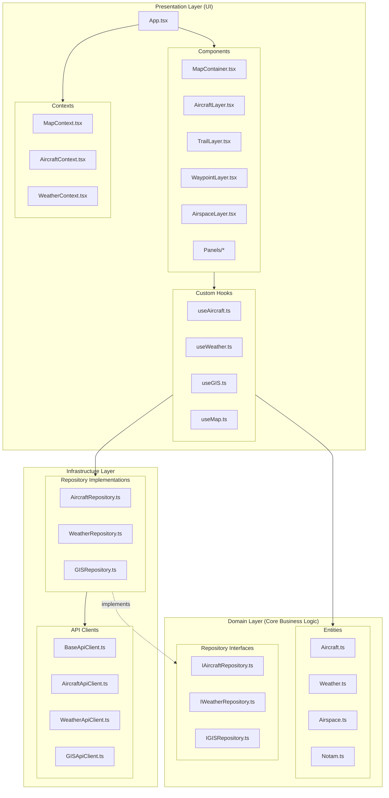
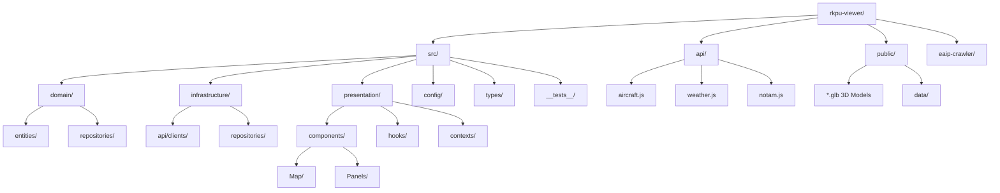
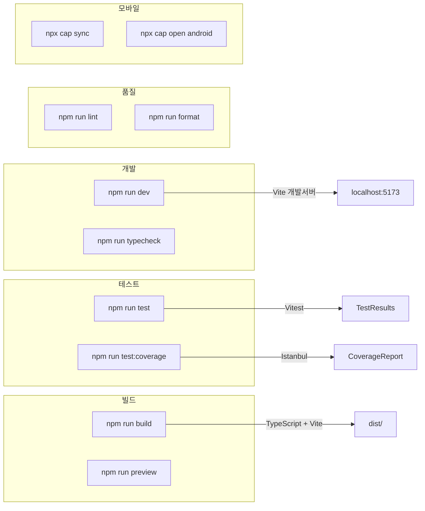
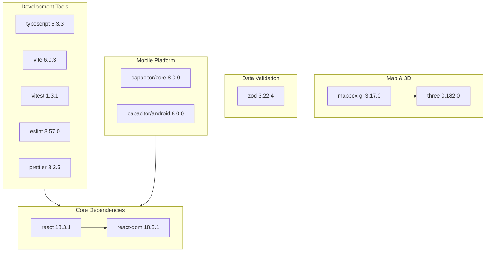

# RKPU-Viewer 프로젝트 구조 및 개발환경 설명

## 1. Clean Architecture 구조 다이어그램



---

## 2. 데이터 흐름 다이어그램

```mermaid
flowchart LR
    subgraph External["External APIs"]
        AirplanesLive[airplanes.live]
        KMAWeather[KMA Weather]
        AWCGOV[aviationweather.gov]
        S3[AWS S3 NOTAM]
    end

    subgraph Vercel["Vercel Serverless"]
        AircraftAPI[/api/aircraft]
        WeatherAPI[/api/weather]
        NotamAPI[/api/notam]
    end

    subgraph App["RKPU-Viewer App"]
        ApiClients[API Clients]
        Repos[Repositories]
        Hooks[Custom Hooks]
        Context[React Context]
        UI[UI Components]
    end

    AirplanesLive --> AircraftAPI
    KMAWeather --> WeatherAPI
    AWCGOV --> WeatherAPI
    S3 --> NotamAPI

    AircraftAPI --> ApiClients
    WeatherAPI --> ApiClients
    NotamAPI --> ApiClients

    ApiClients --> Repos
    Repos --> Hooks
    Hooks --> Context
    Context --> UI
```

---

## 3. 디렉토리 구조 다이어그램



---

## 4. 개발환경 설정 상세

### 4.1 TypeScript 설정 (`tsconfig.json`)

| 설정 | 값 | 설명 |
|------|-----|------|
| Target | ES2020 | 컴파일 대상 ECMAScript 버전 |
| Module | ESNext | 모듈 시스템 |
| Strict Mode | ✅ 활성화 | 엄격한 타입 검사 |
| JSX | react-jsx | React 17+ JSX 변환 |

**Path Aliases:**
| Alias | 경로 |
|-------|------|
| `@/*` | `src/*` |
| `@domain/*` | `src/domain/*` |
| `@infrastructure/*` | `src/infrastructure/*` |
| `@presentation/*` | `src/presentation/*` |
| `@config/*` | `src/config/*` |
| `@types/*` | `src/types/*` |

### 4.2 빌드 도구 (`vite.config.ts`)

| 설정 | 값 |
|------|-----|
| Plugin | @vitejs/plugin-react |
| Server Port | 5173 |
| Build Output | dist/ |
| Path Alias | TypeScript aliases와 동일 |

### 4.3 테스트 환경 (`vitest.config.ts`)

| 설정 | 값 |
|------|-----|
| Environment | jsdom (브라우저 시뮬레이션) |
| Globals | ✅ 활성화 |
| Setup File | src/__tests__/setup.ts |

**Coverage Thresholds (DO-278A AL4 요구사항):**
| 지표 | 임계값 |
|------|--------|
| Statements | 80% |
| Branches | 80% |
| Functions | 80% |
| Lines | 80% |

### 4.4 코드 품질 도구

#### ESLint (`.eslintrc.cjs`)
| 설정 | 값 |
|------|-----|
| Extends | eslint:recommended, @typescript-eslint/recommended, react-hooks/recommended |
| Parser | @typescript-eslint/parser |

**주요 Rules:**
- `@typescript-eslint/no-unused-vars`: error
- `@typescript-eslint/explicit-function-return-type`: warn
- `react-hooks/rules-of-hooks`: error
- `react-hooks/exhaustive-deps`: warn

#### Prettier (`.prettierrc`)
| 설정 | 값 |
|------|-----|
| Semi | true (세미콜론 사용) |
| Single Quote | true |
| Tab Width | 2 |
| Trailing Comma | es5 |
| Print Width | 100 |

### 4.5 환경 변수 (`.env.example`)

| 변수명 | 용도 | 범위 |
|--------|------|------|
| `VITE_MAPBOX_TOKEN` | Mapbox GL 접근 토큰 | 클라이언트 |
| `VITE_API_BASE_URL` | API 기본 URL | 클라이언트 |
| `KMA_API_KEY` | 기상청 API 키 | 서버 전용 |
| `AWS_ACCESS_KEY_ID` | AWS S3 접근 키 | 서버 전용 |
| `AWS_SECRET_ACCESS_KEY` | AWS S3 시크릿 키 | 서버 전용 |
| `AWS_REGION` | AWS 리전 | 서버 전용 |

### 4.6 모바일 앱 설정 (`capacitor.config.json`)

| 설정 | 값 |
|------|-----|
| App ID | com.allofdaniel.rkpuviewer |
| App Name | RKPU Viewer |
| Web Directory | dist |

**Android Settings:**
| 설정 | 값 |
|------|-----|
| androidScheme | https |
| allowMixedContent | true |
| backgroundColor | #000000 |
| webContentsDebuggingEnabled | true |

**Plugins:**
| 플러그인 | 설정 |
|----------|------|
| Keyboard | resize: none |
| StatusBar | style: dark, backgroundColor: #000000 |

---

## 5. NPM 스크립트



| 명령어 | 설명 |
|--------|------|
| `npm run dev` | Vite 개발 서버 실행 (localhost:5173) |
| `npm run build` | TypeScript 컴파일 + Vite 빌드 |
| `npm run preview` | 빌드된 결과물 미리보기 |
| `npm run test` | Vitest 테스트 실행 |
| `npm run test:coverage` | 테스트 + 커버리지 리포트 |
| `npm run lint` | ESLint 검사 |
| `npm run typecheck` | TypeScript 타입 검사 |
| `npx cap sync` | Capacitor 웹 자산 동기화 |
| `npx cap open android` | Android Studio 열기 |

---

## 6. 의존성 구조



### Production Dependencies
| 패키지 | 버전 | 용도 |
|--------|------|------|
| react | 18.3.1 | UI 프레임워크 |
| react-dom | 18.3.1 | React DOM 렌더링 |
| mapbox-gl | 3.17.0 | 3D 지도 |
| three | 0.182.0 | 3D 항공기 모델 |
| zod | 3.22.4 | 런타임 타입 검증 |
| @capacitor/core | 8.0.0 | 모바일 앱 코어 |

### Development Dependencies
| 패키지 | 버전 | 용도 |
|--------|------|------|
| typescript | 5.3.3 | 타입 시스템 |
| vite | 6.0.3 | 빌드 도구 |
| vitest | 1.3.1 | 테스트 프레임워크 |
| eslint | 8.57.0 | 코드 린팅 |
| prettier | 3.2.5 | 코드 포매팅 |

---

## 7. 테스트 구조

| 테스트 파일 | 테스트 수 | 커버리지 영역 |
|------------|----------|--------------|
| `Aircraft.test.ts` | 15+ | 비행단계 감지, 거리계산, 항적필터링 |
| `Weather.test.ts` | 12+ | 비행카테고리, 기상위험도, 측풍계산 |
| `Airspace.test.ts` | 8+ | 폴리곤 판정, 공역진입, 웨이포인트검색 |
| `Notam.test.ts` | 10+ | Q-line 파싱, 유효성검증, 필터링 |

---

## 8. 빠른 시작 가이드

```bash
# 1. 의존성 설치
npm install

# 2. 환경 변수 설정
cp .env.example .env
# .env 파일에 API 키 입력

# 3. TypeScript 검사
npm run typecheck

# 4. 테스트 실행
npm run test

# 5. 개발 서버 시작
npm run dev

# 6. 프로덕션 빌드
npm run build

# 7. 모바일 앱 동기화
npx cap sync

# 8. Android Studio 열기
npx cap open android
```

---

## 9. DO-278A 요구사항 추적 ID 체계

| 접두사 | 영역 |
|--------|------|
| SRS-ENTITY | 도메인 엔티티 |
| SRS-REPO | Repository |
| SRS-API | API 클라이언트 |
| SRS-HOOK | Custom Hooks |
| SRS-CTX | Context |
| SRS-UI | UI 컴포넌트 |
| SRS-TEST | 테스트 |
| SRS-CONFIG | 설정 |

---

*문서 작성일: 2026-01-11*
*작성자: Claude Code*
